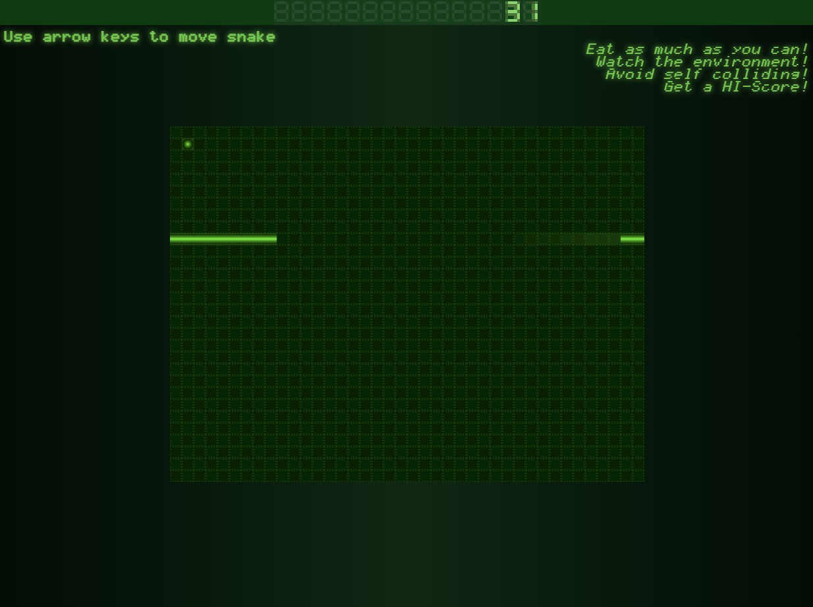

# Snake


## Project Description
A snake game implementation.\
Coded in Vanilla JS and CSS.

Live Demo: https://snake.iskarion.ddns.net/



## Install / Deploy Instructions
 1. Clone Repository
    ```bash
    git clone git@github.com:pinakure/Snake.git /src/snake
    ```
 2. Get up the container
    ```bash
    cd /src/snake
    docker compose up --build -d
    ```